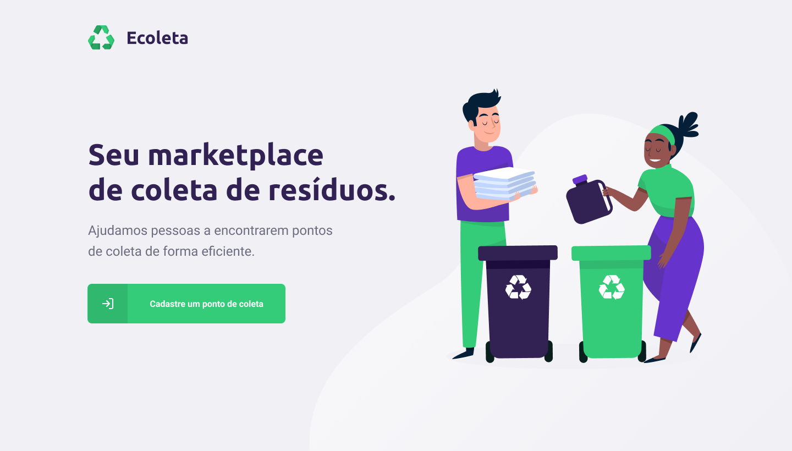

    

 

<h2 align="center">
   ♻️ NextLevelWeek 1.0 ♻️
</h2>

  
   
  
  
  

 

## :computer: Projeto 
Ecoleta - é uma forma de conectar empresas e entidades de coleta de resíduos orgânicos e inorgânicos as pessoas que precisam descartar seus resíduos de maneira ecológica.

 

  

## :rocket: Tecnologias

Esse projeto foi desenvolvido com as seguintes tecnologias:

-   [Node.js](https://nodejs.org/)
-   [ReactJS](https://reactjs.org/)
-   [React Native](https://facebook.github.io/react-native/)
-   [TypeScript](https://github.com/microsoft/TypeScript)

---

Made by :blue_heart: by [Larissa Araújo](https://github.com/arauj0)